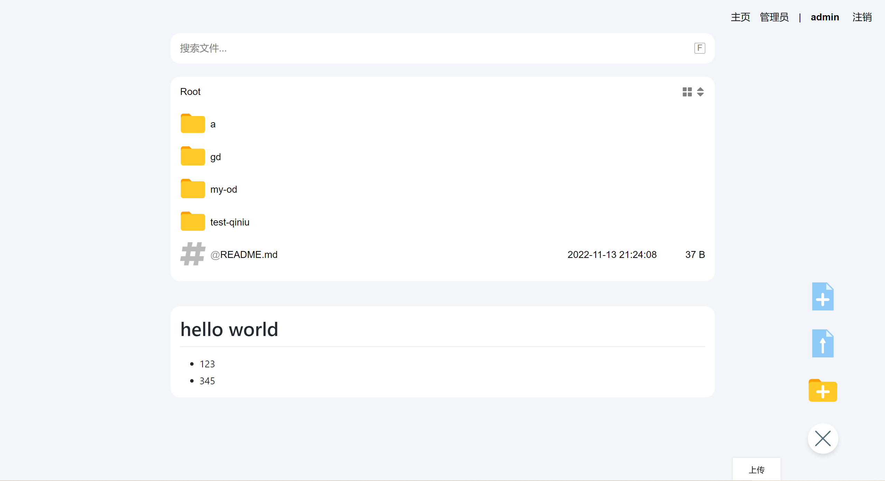
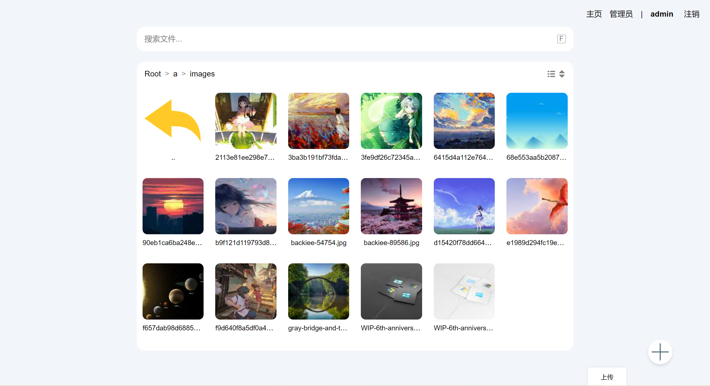
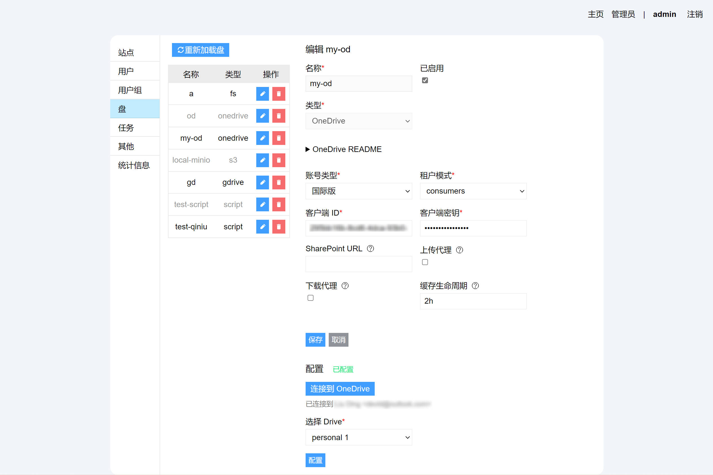
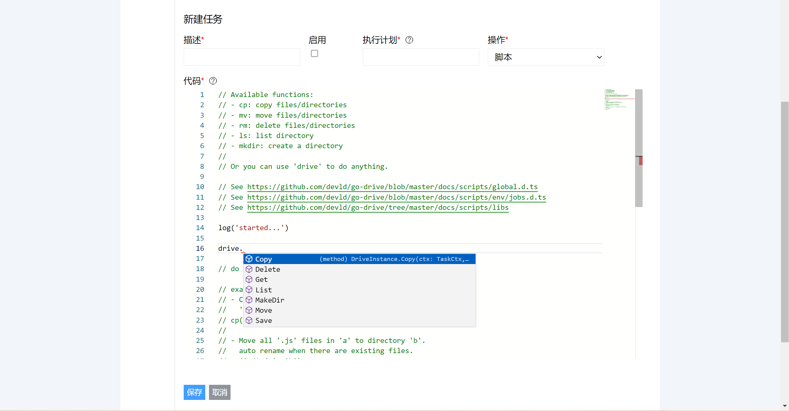
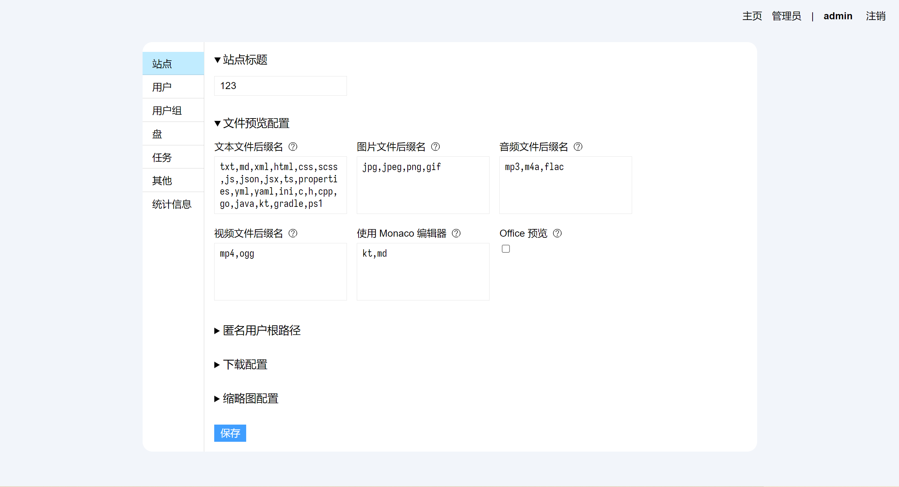

- [Features](#features)
  - [目前支持的云存储](#目前支持的云存储)
  - [功能](#功能)
  - [截图](#截图)
  - [如何使用](#如何使用)
    - [使用 Docker 运行（推荐）](#使用-docker-运行推荐)
    - [直接运行](#直接运行)
    - [手动构建](#手动构建)
- [开始使用](#开始使用)
  - [添加 Drive](#添加-drive)
    - [本地文件](#本地文件)
    - [FTP](#ftp)
    - [SFTP](#sftp)
    - [WebDAV](#webdav)
    - [S3](#s3)
    - [OneDrive](#onedrive)
    - [Google Drive](#google-drive)
    - [Dropbox](#dropbox)
    - [七牛云](#七牛云)
  - [权限相关](#权限相关)
  - [路径挂载](#路径挂载)
  - [文件搜索](#文件搜索)
  - [通过 WebDAV 访问](#通过-webdav-访问)
- [设置相关](#设置相关)
  - [站点相关设置](#站点相关设置)
    - [文件预览配置](#文件预览配置)
    - [匿名用户根路径](#匿名用户根路径)
    - [缩略图配置](#缩略图配置)
  - [脚本类型的 Drive](#脚本类型的-drive)
  - [定时任务](#定时任务)
  - [其他设置](#其他设置)
    - [安装其他 Drive](#安装其他-drive)
    - [文件索引配置](#文件索引配置)
- [FAQ](#faq)
  - [新建或编辑盘并保存后没生效？](#新建或编辑盘并保存后没生效)
  - [如何使用 Nginx 反向代理 go-drive？](#如何使用-nginx-反向代理-go-drive)
  - [创建“本地文件”类型的映射时，显示“路径不存在”](#创建本地文件类型的映射时显示路径不存在)
- [参考](#参考)
  - [脚本环境 API](#脚本环境-api)
    - [通用 API](#通用-api)
    - [定时任务环境](#定时任务环境)
  - [配置文件](#配置文件)
  - [文件路径模式](#文件路径模式)
  - [命令行参数](#命令行参数)

## Features

### 目前支持的云存储

- [本地文件](#本地文件)
- [FTP](#ftp)
- [SFTP](#sftp)
- [WebDAV](#webdav)
- [S3](#s3)
- [OneDrive](#onedrive) (支持世纪互联版及 SharePoint 站点)
- [Google Drive](#google-drive)
- [Dropbox](#dropbox)
- [七牛云](#七牛云)

### 功能

- 文件管理

    - 上传，下载，复制，移动，重命名，删除
    - 拖拽/粘贴上传文件（夹）
    - 拖拽复制/移动/挂载
    - 支持不经过服务器上传及下载，减少服务器流量消耗（仅部分云存储支持，详见下文）
    - 上传文件支持断点续传


    > 按住 `Ctrl`, `Shift` 可进行多选
    >
    > 从系统复制文件（夹）后，按 `Ctrl + V` 直接粘贴上传
    >
    > 按住 `Alt` 并点击文件，可直接下载文件
    >
    > 拖拽文件（夹）时，按住 `Ctrl` 进行复制，按住 `Alt` 创建[路径挂载](#路径挂载)（仅管理员可用）

- 文件打包下载
- 基于用户/组的权限控制

    支持为某目录或文件分配权限，支持限制到用户或组

- 图片浏览([PhotoSwipe](https://github.com/dimsemenov/PhotoSwipe))
- 音乐播放([APlayer](https://github.com/DIYgod/APlayer))
- 文本编辑([CodeMirror](https://github.com/codemirror/))
- 代码编辑([Monaco Editor](https://github.com/microsoft/monaco-editor))
- 展示缩略图

    支持自定义缩略图生成策略，详见[缩略图配置](#缩略图配置)

- 路径挂载

    允许管理员将某文件/目录挂载到任意位置

- Drive 管理界面
- 文件搜索
- 通过 WebDAV 访问
- 定时任务([gocron](https://github.com/go-co-op/gocron))

    支持简单的任务类型（复制/移动/删除）和 JavaScript 脚本类型


### 截图

- 文件管理

    

- 缩略图模式

    

- Drive 设置

    

- 定时任务(JavaScript 脚本)

    

- 站点设置

    

### 如何使用

#### 使用 Docker 运行（推荐）

为了在升级时保留数据，需要将数据目录映射到容器外。

```bash
mkdir go-drive-data
docker run -d --name go-drive -p 8089:8089 -v $(pwd)/go-drive-data:/app/data devld/go-drive
```


其中:

- `-d` 表示在后台运行
- `--name go-drive` 指定容器名称
- `-p 8089:8089` 将容器的 `8089` 映射到主机的 `8089` 端口
- `-v $(pwd)/go-drive-data:/app/data` 将当前目录下的 `go-drive-data` 映射到容器内的 `/app/data`


> 如需修改配置文件，最好将配置文件也映射至容器外。
>
> 这种情况下，需要先将配置文件复制出来，然后指定 `-v` 参数映射配置文件到容器内的 `/app/config.yml`


#### 直接运行


从 [Releases](https://github.com/devld/go-drive/releases) 页面下载适用于你的平台的包，解压后直接运行即可。


预先编译的平台有：

- Linux `amd64/arm/arm64`
- Linux `musl` `amd64/arm/arm64`  (适用于使用 `musl libc` 的发行版，如 Alpine, 软路由等)
- Windows amd64


> 请注意：go-drive 的数据文件默认存放在`当前运行目录`，如需指定为其他目录，请修改 `config.yml` 中的 `data-dir` 配置项


详细的配置，请参考 [配置文件](#配置文件)。


#### 手动构建

构建 go-drive 需要以下工具：


- Golang >= 1.19
- Node.js >= 16, npm >= 8
- GNU make
- GCC

指定构建的版本号`BUILD_VERSION=vx.y`

```bash
BUILD_VERSION=version make all
```

## 开始使用

通过上述方式运行后，访问 [http://localhost:8089](http://localhost:8089)，如需在子路径运行，比如 `http://example.com/drive`，请参考 [如何使用 Nginx 反向代理 go-drive？](#如何使用-nginx-反向代理-go-drive)。


首次运行后，默认账号为：`admin`，密码为 `123456`，**登录后请立即修改密码**。 


### 添加 Drive

在`管理员` -> `盘` 菜单中，添加云存储的映射，目前 go-drive 支持如下几种存储方式：

#### 本地文件

将本机的文件系统映射到某一路径下。

默认情况下，`本地文件`的`根目录`为相对路径，并且被限制在 `<数据目录>/local` 目录中，如果要添加本地文件的映射，则需提前在 `<数据目录>/local` 下新建名为映射名称的目录。

如：数据目录为 `/home/me/go-drive/data`，则新建名为 `test` 的本地文件映射，需要提前新建 `/home/me/go-drive/data/local/test` 目录。

如需去除该限制，请参考[创建“本地文件”类型的映射时，显示“路径不存在”](#创建本地文件类型的映射时显示路径不存在)。


#### FTP

映射 FTP 协议的存储。

#### SFTP

映射 SFTP 协议的存储。

#### WebDAV

映射 WebDAV 协议的存储。

#### S3

映射兼容 S3 协议的云存储，包括但不限于 `AWS S3`, `腾讯 COS`, `阿里云 OSS`。

使用 S3 作为存储后端时，需要在对应的云平台中配置跨域策略和防盗链策略，否则将影响文件的上传与下载。

防盗链配置中，需要将你的域名加入到防盗链白名单中。

跨域配置中，需要允许如下的方法和请求头：

|   来源   | 允许的 Methods |             允许的 Headers             | 暴露的 Headers |
| :------: | :------------: | :------------------------------------: | :------------: |
| 你的域名 |   PUT, POST    | `content-type`, `x-amz-content-sha256` |     `etag`     |
| 你的域名 |   GET, HEAD    |                                        |                |

如果使用 `AWS S3`，可使用如下的 CORS 配置（将 `http://example.com` 换成你的域名）：

```json
[
    {
        "AllowedHeaders": ["content-type", "x-amz-content-sha256"],
        "AllowedMethods": ["PUT", "POST"],
        "AllowedOrigins": ["http://example.com"],
        "ExposeHeaders": ["etag"]
    },
    {
        "AllowedHeaders": [],
        "AllowedMethods": ["HEAD", "GET"],
        "AllowedOrigins": ["http://example.com"],
        "ExposeHeaders": []
    }
]
```

#### OneDrive

映射 OneDrive 存储，目前支持国际版和世纪互联版本，请参考 [OneDrive](./drives/onedrive)。

租户模式：如果是国际版，请根据你的账号类型进行选择，同时要确保与创建 `Azure` 应用时一致；如果是世纪互联版，请选择`common`。

如需映射 SharePoint 站点，请在`SharePoint 站点`中填写你的站点的 URL，例如 `https://xxx.sharepoint.cn/sites/my-site`。


#### Google Drive

映射 Google Drive 存储。由于 Google Drive 没有 API 层面的路径结构，并且可在“目录”中存在同名文件，所以当 Go-drive 遇到同名文件时，会在文件名后面加上 `-<文件 id 前 6 位>`。

Google Drive 中的某些文件类型在下载时会被导出至对应的文件，下面是对应的关系：

- `application/vnd.google-apps.document`: 文档，转换为 `docx`
- `application/vnd.google-apps.spreadsheet`：表格，转换为 `xlsx`
- `application/vnd.google-apps.presentation`：演示，转换为 `pptx`
- `application/vnd.google-apps.drawing`：Drawing，转换为 `svg`
- `application/vnd.google-apps.script`：Script，转换为 `json`


#### Dropbox

Dropbox 使用 JavaScript 实现，请参考[安装其他 Drive](#安装其他-drive)


#### 七牛云

七牛云使用 JavaScript 实现，请参考[安装其他 Drive](#安装其他-drive)


### 权限相关

在 `管理员` -> `其他` 中，可以配置根目录的权限，当某个路径没有匹配到的权限规则时，将向父目录匹配，直至匹配到根路径。

在文件条目上鼠标右键（移动端长按）可呼出上下文菜单，在 `权限` 菜单项中可配置针对该条目的权限。

权限的匹配规则为：

- 越具体的路径优先级越高，即针对 `a/b/c` 的权限的优先级高于对于 `a/b` 的
- `拒绝(Rejected)` 的权限优先级高于 `接受(Accepted)`
- 越具体的`主体`优先级越高，即针对`用户 a` 的权限配置优先级高于针对 `组 b` 的，针对 `组 b` 的权限配置优先级高于 `ANY(针对任意用户，包括未登录的用户)`


### 路径挂载

要挂载某个条目到另一路径下，可在上下文菜单中选择 `挂载到`，并选择目的地。被挂载的条目的名称前面将会出现 `@` 符号（仅管理员可见）。

> 权限仅针对路径，如果将某个条目挂载到另一位置，则该条目在挂载位置的权限将只会匹配挂载位置的权限。


### 文件搜索

搜索功能默认未开启，如需启用搜索功能，在配置文件中找到并修改为如下的配置：

```yaml
search:
  enabled: true
  type: bleve
```

然后重启应用即可。

开启后，需要手动进行一次全盘索引，在 `管理员` -> `其他` -> `文件索引`，如果没有需要排除索引的文件，直接点击“开始索引”即可。

添加或者删除 Drive 后，也需要手动索引一次。

其余情况，如果没有从外部系统修改过文件，则一般情况下无需再进行手动索引。


### 通过 WebDAV 访问

WebDAV 功能默认未开启，如需启用 WebDAV 访问功能，在配置文件中找到并修改为如下的配置：

```yaml
web-dav:
  enabled: true
  prefix: /dav
  allow-anonymous: false
```

然后重启应用即可。

其中：

- `prefix` 为 WebDAV 访问的路径前缀
- `allow-anonymous` 指是否允许匿名访问（但权限控制仍然生效）


## 设置相关

### 站点相关设置

#### 文件预览配置

你可以配置不同后缀名的文件的打开方式。

- 文本文件：这些后缀名文件将使用 `CodeMirror` 打开查看或编辑

    > 仅文件大小 < 128KB 的文件支持

- 图片文件：这些后缀名文件将使用 `PhotoSwipe` 打开预览
- 音频文件：这些后缀名文件将使用 `APlayer` 播放
- 视频文件：这些后缀名文件将支持播放预览
- Monaco 编辑器：这些后缀名文件将使用 Monaco 代码编辑器打开查看或编辑
- Office 预览：启用后 Office 文件可使用 Microsoft 或 Google 提供的服务进行预览

    > 如果你的 go-drive 的访问环境不可访问外网或 go-drive 被部署在内网环境中，那么预览服务将不可用

> 以上配置的文件类型还需浏览器支持才可正常打开预览

#### 匿名用户根路径

当访问者未登录时，默认展示的根目录，可以用来限制未登录的用户可见范围。

#### 缩略图配置

go-drive 支持多种缩略图生成器，请参考[配置文件](#配置文件)。

> 当你修改了配置文件中的缩略图生成器后，你需要重启 go-drive

在缩略图配置中，你可以为不同目录下的文件指定配置文件中不同的缩略图生成器。

在生成缩略图时：

- 首先会使用文件后缀名来寻找合适的生成器，当没有找到合适的生成器时，缩略图生成将失败
- 当找到多个合适的生成器时，会通过路径配置的 `tag` 和 生成器的 `tag` 进行匹配
- 如果有匹配到的 `tag`，那么就使用匹配到的生成器，否则使用第一个根据后缀名匹配到的生成器

缩略图生成映射的格式如下：

```
<Tag1>,[Tag2...]:<Path Pattern>
```

多个 `tag` 使用 `,` 隔开，`:` 后面为路径匹配模式。

路径匹配模式支持通配符，请参考[文件路径模式](#文件路径模式)。


### 脚本类型的 Drive

脚本类型的 Drive 可在 Web 管理界面 `管理员 -> 其他 -> 安装其他 Drive` 安装和删除，请参考[安装其他 Drive](#安装其他-drive)。

### 定时任务

定时任务目前支持如下几种任务类型：

- 复制（移动）
- 删除
- 脚本

    编写 JavaScript 脚本来灵活地执行一些操作，支持的 API 请参考[脚本环境 API](#脚本环境-api)

- 组合

    组合上面几种操作

定时任务的执行计划目前仅支持 Cron 表达式，例如：
```
0    2    *    *    ?
分   时   日   月   周
```

请参考：[https://crontab.cronhub.io/](https://crontab.cronhub.io/)

### 其他设置

#### 安装其他 Drive

其他的 Drive 使用 JavaScript 实现，可以方便的安装和删除而不用重新编译 go-drive。

目前安装源是 `https://api.github.com/repos/devld/go-drive/contents/script-drives`

安装源仅仅是一个返回 `JSON` 数据的链接：
```json
[
    {
        "name": "xxx.js",
        "download_url": "https://example.com/xxx"
    },
    {
        "name": "xxx-uploader.js",
        "download_url": "https://example.com/xxxx"
    }
]
```

其中 `xxx.js` 即 Drive 的实现，同时还有个可选的文件 `xxx-uploader.js` 为运行在浏览器环境中对应的上传器。


实现更多的 Drive 请参考[https://github.com/devld/go-drive/tree/master/docs/scripts](https://github.com/devld/go-drive/tree/master/docs/scripts) 和 [https://github.com/devld/go-drive/tree/master/docs/drive-uploaders](https://github.com/devld/go-drive/tree/master/docs/drive-uploaders)。

#### 文件索引配置

在创建或者删除 Drive 后，需要在这里重新索引文件。

过滤器可以在索引时排除一些文件，请参考[文件路径模式](#文件路径模式)。

## FAQ

### 新建或编辑盘并保存后没生效？

对云存储配置的任何修改和删除，都需要“重新加载盘”，点击 `管理员` -> `盘` 页面上方的 `重新加载盘` 按钮即可。


### 如何使用 Nginx 反向代理 go-drive？

假如你想将应用部署在 `/drive/` 路径下，通过 `https://example.com/drive/` 这样的路径访问。

那么需要进行如下的配置修改：


`config.yml`

```yaml
api-path: "/drive"

# 如果启用了 WebDAV 访问，则还需修改 WebDAV 的 prefix，在前面加上 /drive 这个前缀，比如：
web-dav:
  enabled: true
  prefix: /drive/dav
  allow-anonymous: false
```

Nginx 配置文件

```nginx
location /drive/ {
    proxy_set_header Host $http_host;
    proxy_set_header X-Real-IP $remote_addr;
    proxy_set_header X-Forwarded-For $proxy_add_x_forwarded_for;
    proxy_pass http://127.0.0.1:8089;
    client_max_body_size 10m;
}
```

重启应用和 Nginx 即可。

### 创建“本地文件”类型的映射时，显示“路径不存在”

为了安全考虑，默认情况下，本地文件访问被限制在 `<数据目录>/local` 目录中，如需添加本地文件映射，需要手动在该目录中创建对应的目录。

如需去除该限制，在配置文件中找到并修改为如下的配置：

```yaml
free-fs: true
```

> **注意：如果取消这个限制，那么任何拥有 `admin` 权限的用户，可以任意操作服务器中的文件**


## 参考

### 脚本环境 API

#### 通用 API

> 注意：这里仅列出一些常用的 API，其余 API 请参考 [https://github.com/devld/go-drive/blob/master/docs/scripts/global.d.ts](https://github.com/devld/go-drive/blob/master/docs/scripts/global.d.ts)

```ts
// 将毫秒值转换为 Golang 中的 Duration
declare function ms(ms: number): Duration;

// 暂停执行一段时间
declare function sleep(t: Duration): void;

// 创建一个 Golang 中的 Context，许多 API 都需要 Context 作为参数
declare function newContext(): Context;

// 创建一个 Golang 中的 Context，这个 Context 带有超时限制
declare function newContextWithTimeout(
  parent: Context,
  timeout: Duration
): ContextWithTimeout;

// 发送 HTTP 请求
declare function http(
  ctx: Context,
  method: HttpMethod,
  url: string,
  headers?: SM,
  body?: HttpBody
): HttpResponse;

// 将 Golang 中的 Time 转换为 Date
declare function toDate(goTime: GoTime): Date;

// 一些路径工具
declare const pathUtils: {
  // 清理路径，转换为合法的路径
  clean: (path: string) => string;
  // 拼接路径
  join: (...segments: string[]) => string;
  // 获取路径的父路径
  parent: (path: string) => string;
  // 获取路径的 basename
  base: (path: string) => string;
  // 获取小写的文件后缀名，如 jpg
  ext: (path: string) => string;
  // 是否是根目录，path === ''
  isRoot: (path: string) => boolean;
};

declare enum HASH {
  MD5 = 1,
  SHA1 = 2,
  SHA256 = 3,
  SHA512 = 4,
}

// 一些编码/Hash 工具
declare const encUtils: {
  toHex: (b: Bytes) => string;
  fromHex: (s: string) => Bytes;
  base64Encode: (b: Bytes) => string;
  base64Decode: (s: string) => Bytes;
  urlBase64Encode: (b: Bytes) => string;
  urlBase64Decode: (s: string) => Bytes;
  newHash: (h: HASH) => Hasher;
  hmac: (h: HASH, payload: Bytes, key: Bytes) => Bytes;
};
```

#### 定时任务环境

```ts
// 根 Drive，可以通过它执行任意操作
declare const drive: DriveInstance;

// 记录日志，将会展示在定时任务的执行记录中
declare function log(s: string): void;

// 复制文件，from 支持通配符，to 必须是一个存在的目录
declare function cp(from: string, to: string, override: boolean): DriveEntry;
// 移动文件，from 支持通配符，to 必须是一个存在的目录
declare function mv(from: string, to: string, override: boolean): DriveEntry;
// 删除文件，path 支持通配符
declare function rm(path: string): void;
// 获取目录中的文件
declare function ls(path: string): DriveEntry[];
// 创建目录
declare function mkdir(path: string): DriveEntry;
```

### 配置文件

```yaml
# 应用监听的地址，如 0.0.0.0:8089，或 :8089
listen: :8089

db:
  # 数据库类型，目前支持: sqlite, mysql
  type: sqlite
  # 数据库名称
  # sqlite: 文件名
  # mysql: 数据库名称
  name: data.db
  # 数据库主机, 仅 mysql
  #host: 127.0.0.1
  # 数据库端口号, 仅 mysql
  #port: 3306
  # 数据库用户名, 仅 mysql
  #user: user
  # 数据库密码，仅 mysql
  #password: password
  # 一些特殊的参数, 参考 https://gorm.io/docs/connecting_to_the_database.html
  #config:
  #  loc: UTC

# 数据目录， 所有的应用数据都会存储在这里。
# 这个目录下可能有这些文件：
# - lang: 语言文件
# - local: 本地文件类型的 Drive 的文件将存储在这里
# - script-drives: JavaScript 实现的 Drives 将存放在这里
# - drive-uploaders: 一些自定义的上传器
# - sessions: 用户会话保存目录
# - temp: 临时目录
# - thumbnails: 生成的缩略图缓存存放在这里
# - data.db: SQLite 数据库文件
data-dir: ./

# 临时目录. 默认是 <数据目录>/temp
temp-dir: ""

# 前端的资源文件将存放在这里
web-dir: ./web

# 语言文件
lang-dir: ./lang
# 如果客户端指定的语言不支持的话，将回退到这个语言
default-lang: en-US

# 最大同时执行的任务数，任务包括：复制、移动、删除等。
max-concurrent-task: 100

# 禁用本地文件类型的 Drive 的路径限制
# 设置为 false：本地文件类型的 Drive 的路径将相对于 <数据目录>/local
# 设置为 true：本地文件类型的 Drive 的路径将是绝对路径
# 警告：如果你将该选项设置为 true，那么拥有管理员权限的用户将可以访问服务器中的任何文件
free-fs: false

thumbnail:
  # 缩略图缓存的有效期
  ttl: 720h
  # 同时生成缩略图的最大任务数，默认是 CPU数量/2
  #concurrent: 4

  # 缩略图生成器，目前支持 image, text, shell
  # file-types 为该生成器支持的文件后缀名
  # tags 为英文逗号隔开的 tag，用来为特定文件/路径匹配生成器
  handlers:
    # image: 内置的图片缩略图生成器(仅支持 jpg, png, gif)
    # 注意：这个生成器性能可能不太好
    - type: image
      tags:
      file-types: jpg,jpeg,png,gif
      #config:
      #  # 最大支持的文件大小
      #  max-size: 33554432 # 32MB
      #  # 最大支持的像素大小 (width * height)
      #  max-pixels: 36000000 # 6000*6000
      #  # 生成的缩略图宽度
      #  size: 220
      #  # 缩略图质量(1-100)
      #  quality: 50

    # text: 内嵌的文本文件缩略图生成器
    # 它将读取文件的一部分内容，生成一个 SVG 文件
    - type: text
      tags:
      file-types: txt,md,xml,html,css,scss,js,json,jsx,properties,yml,yaml,ini,c,h,cpp,go,java,kt,gradle,ps1
      #config:
      #  font-size: 12
      #  # 生成的缩略图宽度
      #  size: 220
      #  # 最多读取多少字节
      #  max-read: 8192
      #  # 图片 padding
      #  padding: 10

    # shell: 执行一些外部命令来生成缩略图，请查看示例  docs/thumbnail-shell-example.sh
    # 如果文件可读并且 write-content 是 true，那么文件内容将被写入标准输入
    # 然后，生成的缩略图需要被写出到标准输出
    # 如果进程返回 非0，则生成失败
    # 以下环境变量将被设置：
    #
    # GO_DRIVE_ENTRY_TYPE: file|dir
    # GO_DRIVE_ENTRY_REAL_PATH: 真实的文件路径（无 chroot 和 挂载）
    # GO_DRIVE_ENTRY_PATH: 文件路径
    # GO_DRIVE_ENTRY_NAME: 文件名
    # GO_DRIVE_ENTRY_SIZE: 文件大小，目录为 -1
    # GO_DRIVE_ENTRY_MOD_TIME: 修改时间（毫秒时间戳）
    # GO_DRIVE_ENTRY_URL: 文件内容或目录内容的 URL (例如 /content/a/a.txt or /entries/a)
    #- type: shell
    #  tag:
    #  file-types: mp4,avi
    #  config:
    #    # 命令行
    #    shell: ffmpeg -hide_banner -loglevel error -i - -frames:v 1 -vf scale=220:-1 -f mjpeg -
    #    # 输出的文件 mime-type
    #    mime-type: image/jpeg
    #    # 是否将文件内容写入标准输入
    #    write-content: true
    #    # 最大支持的文件大小，如果 <= 0，则没有限制
    #    max-size: -1
    #    # 生成的超时时间，如果 <= 0，则没有限制
    #    timeout: 10m

auth:
  # 用户的会话有效时间
  validity: 2h
  # 如果为 true，那么当用户访问系统时，将会自动刷新会话有效时间
  auto-refresh: true

# WebDAV 访问配置
#web-dav:
#  enabled: true
#  prefix: /dav
# 是否允许匿名访问（权限管理依然有效）
#  allow-anonymous: false

# 搜索配置
search:
  enabled: false
  # 搜索器: 目前仅支持 bleve
  type: bleve

# API 路径. 如果 go-drive 允许在一个反向代理（如 nginx）后面，并且在子路径下
# 那么就需要指定 API 路径
api-path: ""

# 前端的资源文件将通过该路径访问
web-path: ""
```

### 文件路径模式

- `**` 匹配零个或多个目录
- `*` 匹配任意个数的非目录分隔符字符
- `?` 匹配单个非目录分隔符字符

例如：
- `a/*.js` 将匹配 `a` 目录中所有 `.js` 文件，但**不包括** `a` 中的子目录中的文件
- `a/**/*.js` 将匹配 `a` 目录中所有 `.js` 文件，并且**包括** `a` 中的子目录中的文件

### 命令行参数

```
  -c string
        指定配置文件路径
  -show-config
        展示当前的配置文件信息
  -v    显示版本信息
```
